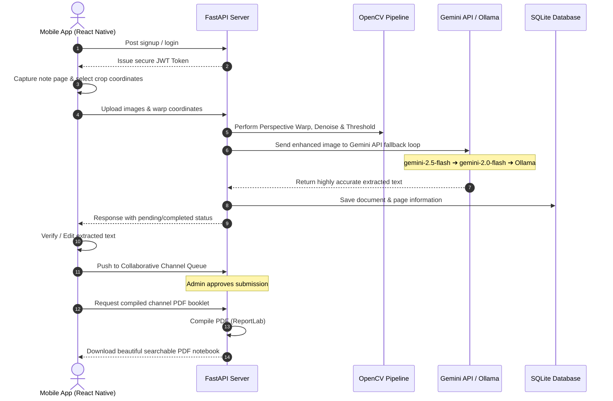

# NoteHub 📚

> **Transform physical pages into digital intelligence.** Capture physical notes via your camera, auto-crop and enhance with OpenCV, extract text instantly using Google Gemini API (with local Ollama LLaVA fallback), collaborate inside access-controlled channels, and compile everything into gorgeous, searchable PDF booklets.

---

## 🚀 Key Features

NoteHub is a production-grade, collaborative document processing platform that brings advanced computer vision and generative AI directly to your mobile device.

### 🧠 Dual-Engine AI OCR Pipeline
* **Gemini AI Core (Primary):** Features a dynamic, self-healing API fallback loop traversing the latest Gemini models (`gemini-2.5-flash` ➔ `gemini-2.0-flash` ➔ `gemini-1.5-flash` ➔ `gemini-1.5-pro`) to ensure lightning-fast, high-precision document extraction.
* **Local Ollama Fallback (Offline-First):** Automatically routes to a local Ollama server running the `llava` vision model if the cloud API is offline or key is missing.

### 🖼️ Advanced OpenCV Preprocessing
* **Interactive Warp Perspective (Deskewing):** Straighten documents using a manual 4-point crop interface on your phone.
* **Image Optimization Core:** Automatically applies a multi-stage OpenCV pipeline: Grayscale Conversion ➔ fastNlMeans Denoising ➔ Gaussian Adaptive Thresholding to eliminate uneven lighting, shadows, and scan artifacts.
* **Edit-After-Capture UI:** View extracted text directly alongside the processed document and correct any mistakes prior to final upload.

### 🤝 Collaborative Workspace Channels
* **Access Control Roles:** Organize collaborative learning circles with defined roles: **Admins**, **Editors**, and **Viewers**.
* **Submissions Review Queue:** Admin-controlled staging areas where editors/viewers submit captured notes, and admins approve or reject submissions before they go live on the public feed.
* **Infinite Scroll & Reordering:** A highly-responsive, infinite-scrolling feed of approved notes with an interactive drag-and-drop custom reordering list (`react-native-draggable-flatlist`) for custom sequencing.
* **Real-time Invites & Notification Center:** Search users dynamically and send channel invitations with an inbox to accept or decline.

### 📄 Premium PDF Generation
* **Private Documents:** Compile multi-page scans into single, searchable PDF documents on demand.
* **Collective Notebooks:** Export entire collaborative channels into beautifully formatted PDF notebooks, styled with dynamic section headers, metadata titles, author descriptors, and page-break separators.

### 🔒 Secure Authentication & OTP Verification
* **JWT Identity Token:** Standardized token validation with customized expiration handling.
* **One-Time Password (OTP) Verification:** Fully-functional email-verified signup flow with optional SMTP connection and built-in terminal mock bypass for rapid test environments.

---

## 🛠️ Architecture & Workflow



---

## 📂 Repository Layout

```
notehub/
├── backend/
│   ├── main.py              # Core FastAPI app (endpoints, DB tables, OCR routing, ReportLab compiler)
│   ├── requirements.txt     # Python production and development dependencies
│   ├── Dockerfile           # Multi-stage container definition with system-level OpenCV dependencies
│   ├── .dockerignore        # Excluded container folders
│   ├── .env.example         # Template for backend secrets and API keys
│   └── notehub.db           # Local SQLite database instance (git-ignored)
│
├── frontend/
│   ├── app/                 # Expo Router application structure
│   │   ├── auth/            # Sign In, OTP Verification, and Signup Screens
│   │   └── tabs/            # Main tabs: Capture | Docs | Channels | Profile
│   ├── assets/              # App launcher icons, splash screens, and sleek 3D logo resources
│   ├── components/          # Reusable React Native UI elements (Buttons, InputFields, Modals)
│   ├── context/             # React Context for Global Authentication states
│   ├── services/            # Axios API config with dynamic IP resolution and request interceptor
│   ├── package.json         # Javascript dependencies (Expo 51, Reanimated, Draggable List)
│   └── .env.example         # Template for Expo configuration
│
├── scratch/                 # Utility scripts for database fixing and verification
│   ├── setup_test_accounts.py
│   └── delete_user.py
└── render.yaml              # Blueprint file for automated Render Cloud deployments
```

---

## ⚙️ Environment Configurations

### 1. Backend (`/backend/.env`)
Create a file named `.env` in the `backend/` directory. Check `backend/.env.example` for details:
```env
# Security & Auth
SECRET_KEY=your-production-strength-cryptographic-key-here
DB_PATH=notehub.db

# Primary AI OCR Core (Recommended)
GEMINI_API_KEY=AIzaSy... # Your Google AI Studio API Key

# Offline Local Fallback (Ollama)
OLLAMA_URL=http://localhost:11434
OLLAMA_MODEL=llava

# Verification Email Config (SMTP)
# Leave blank to fallback to terminal mock mode (prints OTP code to console)
SMTP_HOST=smtp.gmail.com
SMTP_PORT=587
SMTP_USER=your_gmail_address@gmail.com
SMTP_PASSWORD=your_gmail_app_specific_password_here
```

### 2. Frontend (`/frontend/.env`)
Create a file named `.env` in the `frontend/` directory. Check `frontend/.env.example` for details:
```env
# Production Override for backend URL
EXPO_PUBLIC_API_URL=https://your-backend-service-url.render.com
```

---

## 💻 Local Quick Start

### Prerequisites
* **Python 3.10+** (https://www.python.org/downloads/)
* **Node.js 18+** (https://nodejs.org/)
* **Expo Go App** (installed on your mobile device)
* *(Optional)* **Ollama** (https://ollama.com/) for local OCR backup

---

### Step 1: Start Local Ollama Server (Optional fallback)
1. Download and install Ollama from [ollama.com](https://ollama.com/).
2. Pull the vision-capable LLaVA model:
   ```bash
   ollama pull llava
   ```
3. Keep Ollama running in the background.

---

### Step 2: Initialize & Launch Backend (FastAPI)
1. Navigate to the backend directory:
   ```bash
   cd backend
   ```
2. Create and activate a python virtual environment:
   ```bash
   # Create
   python -m venv venv

   # Activate (Linux/macOS)
   source venv/bin/activate
   # Activate (Windows PowerShell)
   .\venv\Scripts\Activate.ps1
   ```
3. Install dependencies:
   ```bash
   pip install -r requirements.txt
   ```
4. Start the development server:
   ```bash
   uvicorn main:app --reload --host 0.0.0.0 --port 8000
   ```
   *(Note: Using `--host 0.0.0.0` ensures the server is reachable by your phone on the local network.)*

---

### Step 3: Initialize & Launch Frontend (Expo Go)
1. Navigate to the frontend directory:
   ```bash
   cd ../frontend
   ```
2. Install JS packages:
   ```bash
   npm install
   ```
3. Boot the Expo bundler:
   ```bash
   npx expo start
   ```
4. **Connecting Your Device:**
   * Ensure your mobile device and computer are connected to the **same Wi-Fi network**.
   * NoteHub uses a dynamic request interceptor in `services/api.js`. You can enter your computer's local network IP (e.g. `http://192.168.1.42:8000`) or configure local tunnels like `localtunnel` or `ngrok` inside the settings in the app.
   * Open the **Expo Go** application on your phone and scan the QR code displayed in your terminal.

---

## ☁️ Cloud Deployment (Render Blueprint)

NoteHub is configured to be deployed on the **Render** cloud platform with zero configurations using `render.yaml`.

### Render Deployment Configuration:
1. **Dockerfile:** In `./backend/Dockerfile`, NoteHub uses a Debian-based multi-stage container that automatically provisions system libraries required for OpenCV:
   ```dockerfile
   RUN apt-get update && apt-get install -y \
       libgl1-mesa-glx \
       libglib2.0-0 \
       && rm -rf /var/lib/apt/lists/*
   ```
2. **Uvicorn Concurrency Safety:** The server runs on a single Uvicorn worker to prevent thread and write locks on SQLite databases in containerized environments.
3. **Database Persistence:** By default, SQLite stores data in the container workspace. To persist databases on Render Free/Starter tiers, configure a persistent disk mount at `/app/notehub.db` or use Render's built-in persistent disk store as defined in `render.yaml`.

### To Deploy on Render:
1. Push your NoteHub project to a private GitHub repository.
2. Log into your [Render Console](https://dashboard.render.com/).
3. Click **New** ➔ **Blueprint**.
4. Connect your NoteHub repository.
5. In the env vars panel, define your `GEMINI_API_KEY` for flawless cloud OCR.
6. Trigger the deployment! The app will build the backend container and be live instantly.

---

## 🧪 Testing Accounts & Quick Bypasses

For seamless developer onboarding and verification testing, NoteHub has built-in auto-verification and password bypasses for two pre-configured test profiles. 

If signing up or logging in with these exact emails, OTP verification is skipped and the login instantly succeeds:
* **Admin Profile:** `admin@admin` (password: any)
* **Editor Profile:** `bruh@bruh` (password: any)

*You can quickly populate your database with test accounts by running: `python scratch/setup_test_accounts.py` from the root workspace.*

---

## 🛠️ Tech Stack & Library Credits

| Tier | Technology | Description |
|---|---|---|
| **Frontend Framework** | React Native, Expo Go | Cross-platform native compilation |
| **Frontend Navigation** | Expo Router | Modern file-system based routing |
| **Frontend Utilities** | Reanimated, DraggableFlatList | Smooth gesture and transition feedback |
| **Backend Core** | FastAPI (Python) | High-speed, typed ASGI microframework |
| **OCR Vision Core** | Google Gemini API | Primary state-of-the-art vision extraction |
| **OCR Local Engine** | Ollama, LLaVA | Local execution for data-isolated deployments |
| **Image Preprocessing** | OpenCV, NumPy, Pillow | High-performance visual transform libraries |
| **PDF Compilation** | ReportLab | Streamed binary document building |
| **Database** | SQLite3 | Fast relational storage with self-healing migrations |
| **Authentication** | PyJWT | Stateless secure token management |
